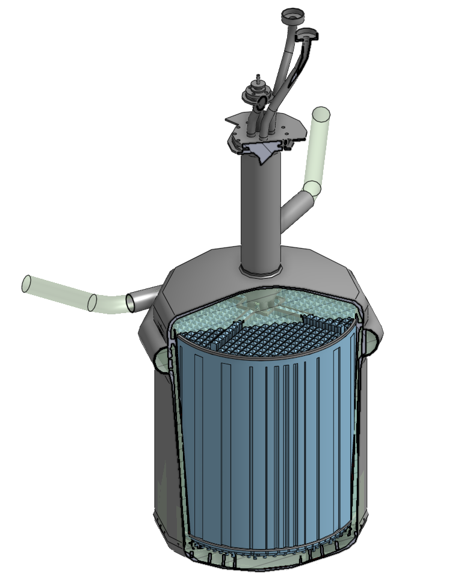
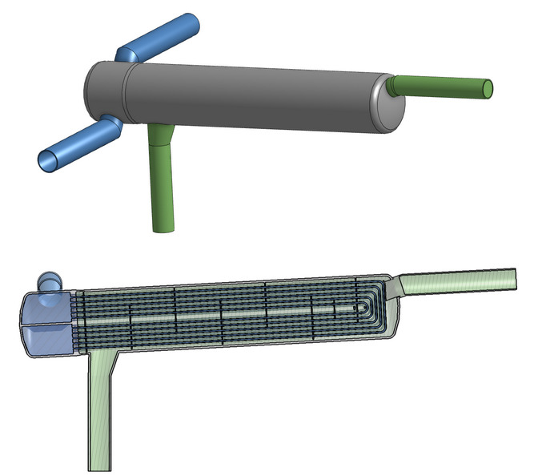
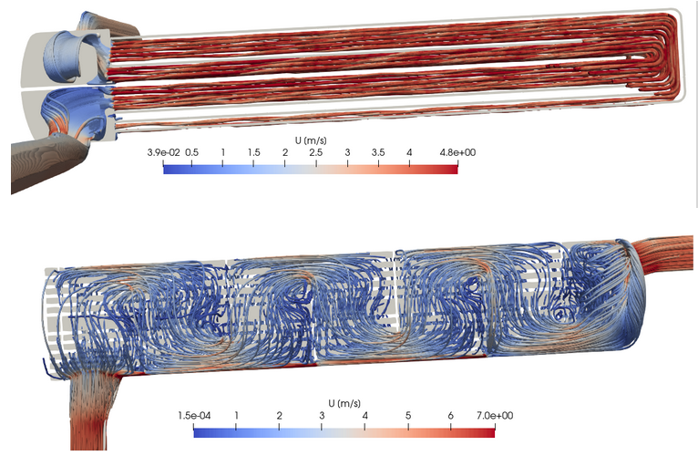
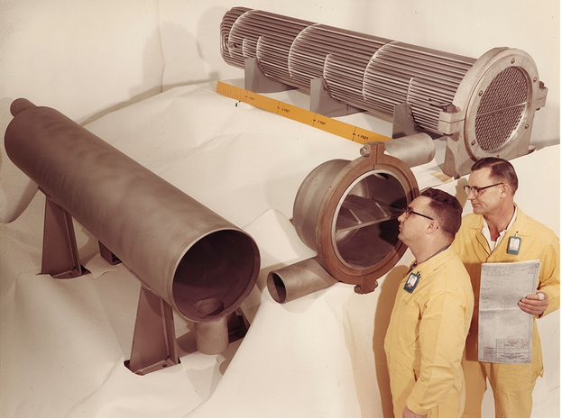
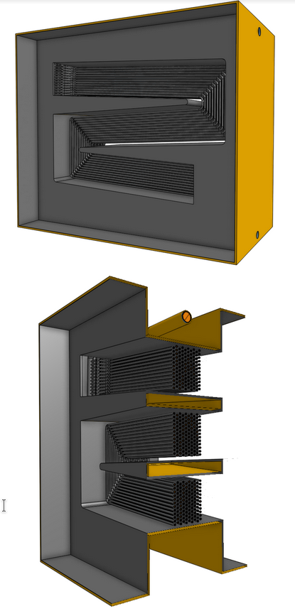
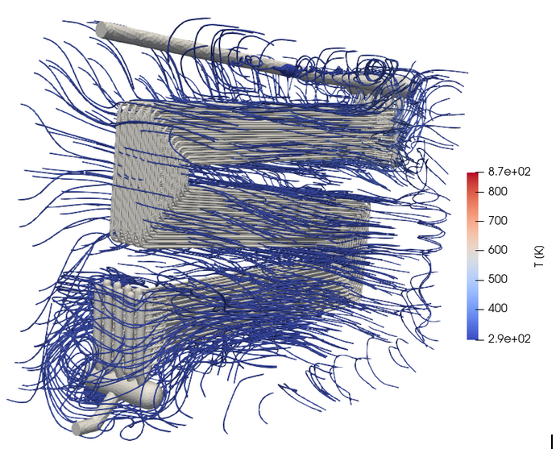

# msre

> detailed cad model of the [msre](https://en.wikipedia.org/wiki/Molten-Salt_Reactor_Experiment) (molten salt reactor experiment), operated by oak ridge national laboratory 1965-69.

## msre core

[core/msrecore.pdf](core/docs/msrecore.pdf) lists reference of the msre core design, documented in the old msre reports and located in the repository [github.com/openmsr/msr-archive](https://github.com/openmsr/msr-archive/blob/master/README.md).

the work-in-progress cad model can be found [here](https://cad.onshape.com/documents/4f04f63bfd4138a61a54b3f8/w/11cb17d9ef25bb27f8ada6c0/e/72f417dd8eb3e2fa4f9ccb9e) on onshape.

note that this work and the cad model is under the GNU General Public License v3.0

## msre heat exchangers

open-access [master's thesis](https://ltu.diva-portal.org/smash/get/diva2:1546993/FULLTEXT01.pdf) produced by Malcolm Akner about simulations of the heat exchangers of the msre, titled: 

> Validating results from the Molten Salt Reactor Experiment by use of turbulent CFD simulations
> A study of a modified U-tube shell-and-tube primary heat exchanger and radiator with molten salts

### msre primary heat exchanger

[onshape primaryheatexchanger cad model](https://cad.onshape.com/documents/03be2f510296a2e264886390/w/8cfbca3b7b9682dd4e53a998/e/54728fd981a1b4f5594c73d6)

[simscale primaryheatexchanger simulation model](https://www.simscale.com/projects/MalcolmAkner/phex_-_final_version/)

### msre radiator

[onshape radiator cad model](https://cad.onshape.com/documents/bf944323ed6a82e05924078c/w/2a25d73c5a3a66824d2d5fbd/e/a83d5535602a053216fedff4)

[simscale radiator simulation model](https://www.simscale.com/projects/MalcolmAkner/msre_radiator_public/)

---

please contact [me](https://github.com/aslakstubsgaard) if you want to contribute.
note that this work and the cad model is under the GNU General Public License v3.0

---
