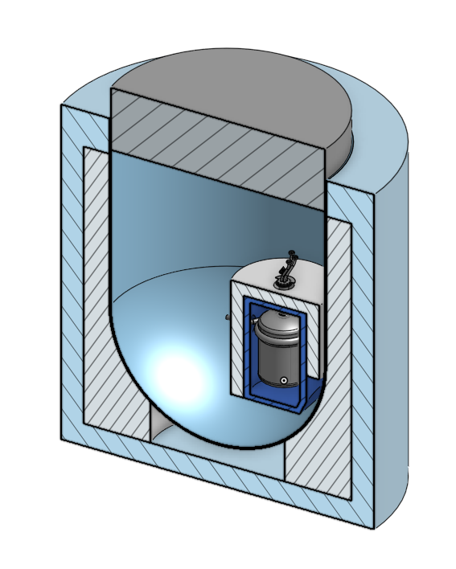

# msre

detailed cad model and openmc benchmarks of the [msre](https://en.wikipedia.org/wiki/Molten-Salt_Reactor_Experiment) (molten salt reactor experiment), operated by oak ridge national laboratory 1965-69.

[onshape cad model v17](https://cad.onshape.com/documents/4f04f63bfd4138a61a54b3f8/v/b8c29a0cedda86dfc6948111/)
cad model includes crude drawings of the insulation, thermal shield, and the reactor pit, but not detailes such as components or piping.
all part names' begining correspond to it's material, e.g. graphite, salt, or inor-8 (hasteloy n).
all core parts are thermally expanded to the operating temperature (currently to the temperature of the zero power experiments during commisioning). note that graphite thermal expansion coefficients are only given for room temperature and thus likely underpredicted and the control rod assembly temperature is unknow and like much higher than currently assigned.

[core/msrecore.pdf](core/docs/msrecore.pdf) lists reference of the msre core design, documented in the old msre reports and located [here](https://github.com/openmsr/msr-archive/blob/master/README.md).

individual parts or assemblies can be exported directly from onshape. step files of entire msre assembly and one control rod assembly can be found in .

this work and the cad models are under the GNU General Public License v3.0

# openmc benchmark
openmc benchmark include:
- msre cad with settable control rods
- msre isothermal temperature coefficient calculation
- msre depletion analysis with fission products removal

prerequisites
- [openmc](https://docs.openmc.org/en/stable/) automated source installation scripts for linux can be found [here](https://github.com/openmsr/openmc_install_scripts)
- [CAD_to_openMC](https://github.com/openmsr/CAD_to_openMC) is an open-source package to convert CAD geometry (in the form of '.step' files) into an openmc-readable h5m file

# msre heat exchangers thermohydralics
open-access [master's thesis](https://ltu.diva-portal.org/smash/get/diva2:1546993/FULLTEXT01.pdf) produced by Malcolm Akner about simulations of the heat exchangers of the msre, titled:

Validating results from the Molten Salt Reactor Experiment by use of turbulent CFD simulations
- A study of a modified U-tube shell-and-tube primary heat exchanger and radiator with molten salts
