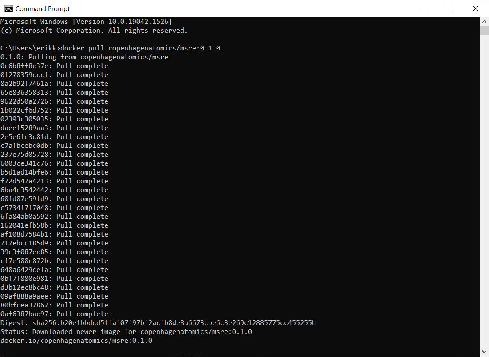
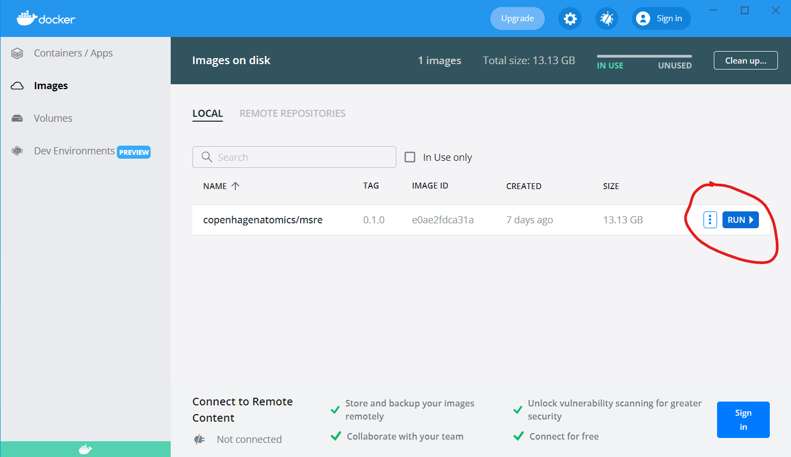
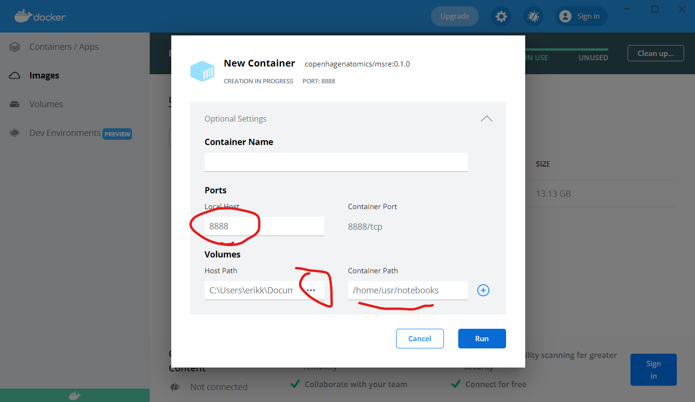
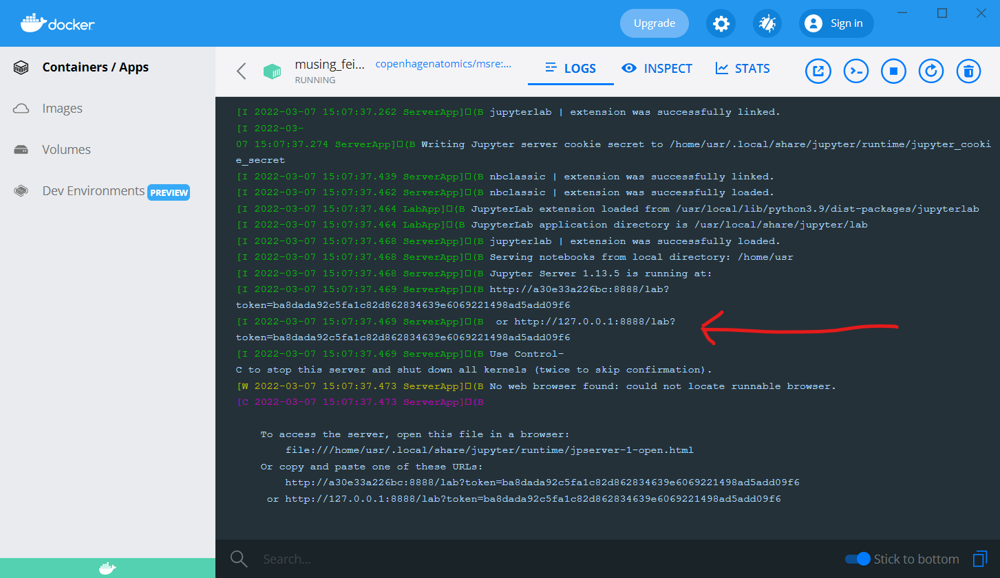
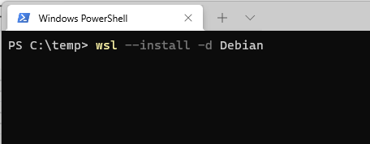
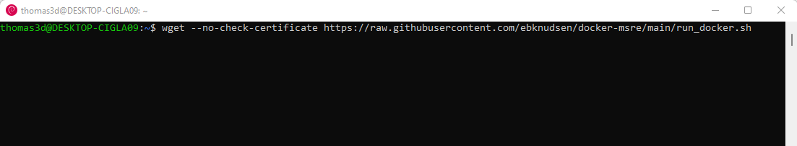
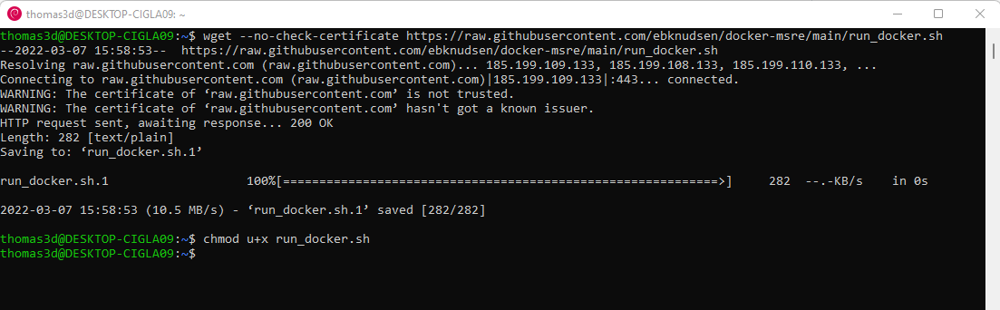
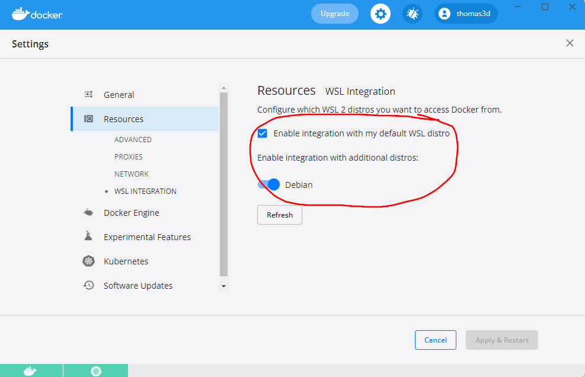

# docker-msre
This repository is created for the purpose of creating a docker conatiner which includes not only support for OpenMC with DAGMC/MOAB, embree, and double_down libraries, but also a Jupyter notebook server. The "raison d'etre" for this is to run a virtual version of The Molten Salt Reactor Experiment (MSRE). The experiment itself was performed physically in the '60s at Oak Ridge National Lab (ORNL), Tennessee,  US.

# Getting started:
1. Install the docker engine on your system (for windows and MacOS: docker-desktop, for Linux: docker server)
  Instructions for how to do this may be found on the Docker website at: [Docker installation](https://docs.docker.com/engine/install/)
2. Run the msre docker container.
    - Linux:
        1. Open a terminal, navigate to a directory where you want to run.
        2. Download the msre-docker runscript, and run it:
        ```{bash tidy=false}
        wget https://raw.githubusercontent.com/openmsr/msre_docker/main/run_docker.sh
        chmod u+x run_docker.sh
        ./run_docker.sh
        ```
        The script contains a call to ```docker run``` with some options preset. Among other things it sets up a subdirectory called notebooks which is shared between the conatiner and the host so that you can keep data between runs.
        Feel free to inspect the runscript if you prefer to run your docker manually. If you'd prefer for instance to run commands in the docker from a shell
        you may do so by adding the option ```--entrypoint /bin/bash``` to the docker run command.
        3. If you used the run-script "as is" you should now be able to open a browser and point it to "https://127.0.0.1:8888" and be treated with a login page to Jupyter.
        Please enter "docker" in the password box, which should provide you with the base Jupter Lab screen.
        4. In the example_notebooks folder open the MSRE.ipynb file. You are now ready to run!
      
      ## Troubleshooting:
        - If the wget command fails with a message complaining about certificates you may bypass this by adding ```--no-check-certificate``` to the command.
        - If you get an error message saying: "docker: Cannot connect to the Docker daemon at unix:///var/run/docker.sock. Is the docker daemon running?." that likely means that you need to start the docker engine. This can be done using the command:  
        ```sudo dockerd```  
        - If you get an error similar to: "Got permission denied while trying to connect to the Docker daemon socket...", it is likely that your user needs to be added to the "docker" group. To check which groups your user belongs to you may use the groups command. To add your user to the docker group you may use:  
        ```sudo usermod -aG docker <username>```  
        where \<username\> is your unix username. 

  - Windows:
    There are two options for running the docker on a windows system:
    1. Install the docker-desktop application.
    Once you have downloaded and installed the application in the normal manner from docker.com, you may proceed by:
        1. Open the command prompt and issue: docker pull copenhagenatomics/msre:0.1.0. This will look like this 
        3. Open the docker-desktop application. The msre docker image should now be visible on the "images"-tab. 
        4. Click on the run-button and then on options. Here we need to set a few parameters to mimic the run_docker.sh script. You should now have a dialog: 
        4. Once the docker has been downloaded and started, you should see among many other messages something about a Jupyter Server at "http://127.0.0.1:8888/lab?token=...".  Please copy this entire URL and paste it into the adress field of your browser. You should now see the Jupyter lab interface and may proceed.
  
    2. Install Windows Subsystem for Linux (WSL) and run the docker from the command-line there.
    N.b. In fact the docker-desktop application also relies on WSL. 
    WSL is a native windows system that enables users to run anyh and all Linux applications natively on Windows 10 and 11, including parallelization and even access to acceleration through GPUs.
    Please note that the process may require updates to Windows to be installed and also rebooting your system. Furthermore, it may also require you to edit settings in the BIOS to enable virtualization on your system.  
    First you must install a Linux kernel in WSL. Open a command prompt and run the command  
    ```wsl --install --distribution debian``` (or shorter ```wsl --install -d debian```)
    
    
    Once this is done wsl will start and you can proceed proceed to get the run-script using wget:  
    ```wget --no-check-certificate https://raw.githubusercontent.com/openmsr/msre_docker/main/run_docker.sh```
    Set the executable bit on this script and run it to start the docker as if on Linux:
    ```chmod u+x run_docker.sh```
    At this point you should be able to run the script ```./run_docker.sh``` and point your browser to "127.0.0.1:8888" or "localhost:8888" to get into Jupyter notebook.
    
    ## Troubleshooting:
    Should you run into problems, please ensure that the following options have been set.  
    First, we need to tell docker to use the debian kernel in WSL. This is done in the setting pane under resources   
    Second, a number of windows features need to be turned on:
    
    Should you still have problems - please contact us (for instance by opening an issue in this repo) and we'll help you out.
3. Jupiter notebook 
 The default password for the jupyter notebook is 'docker'.
