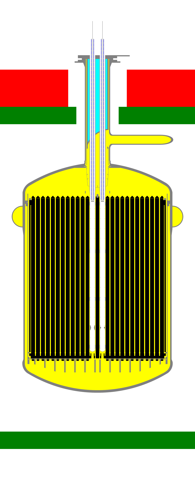

# openmc_msre_notebook

 

List of Jupyter Notebooks `Openmc` simulations of the Molten Salt Reactor Experiment (MSRE), operated at ORNL in the 1960s.
All scripts are set up using `.h5m` files (surface mesh) of detailed CAD models of the MSRE (designed with `OnShape` CAE tool and available to downlaod [here](https://github.com/openmsr/msre/tree/deplete/step_files)).
The surface mesh was created with `Cubit` and is available in the [/h5m](https://github.com/openmsr/openmc_msre_notebooks/tree/main/h5m) folder. Soon a `gmsh` version will also be available.

## Extra libraries required:
 - **Pandas**
 - **Numpy**
 - **Scypy**
 - **Seaborn**

## Depletion msr
Some notebooks use a different branch of Openmc: [openmsr/msr](https://github.com/openmsr/openmc/tree/msr_13.2), where msr functionalities have been added.   
