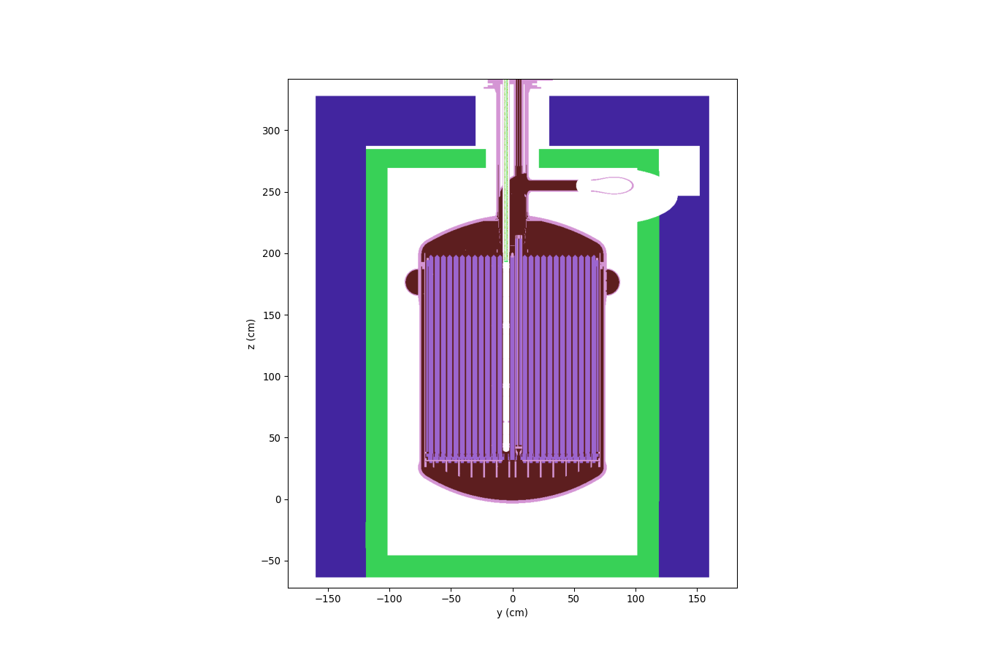

# OpenMC MSRE notebooks

`OpenMC` simulation examples of the Molten Salt Reactor Experiment (MSRE), operated at ORNL in the 1960s.
All scripts are set up using the [h5m meshed files](https://github.com/openmsr/msre/tree/master/h5m) obtained with the open source meshing tool [CAD-to-OpenMC](https://github.com/openmsr/CAD_to_OpenMC) from a CAD version of the the MSRE, designed with the CAE tool `OnShape` and available for export here: [onshape msre model](https://cad.onshape.com/documents/4f04f63bfd4138a61a54b3f8/v/b8c29a0cedda86dfc6948111/).  
